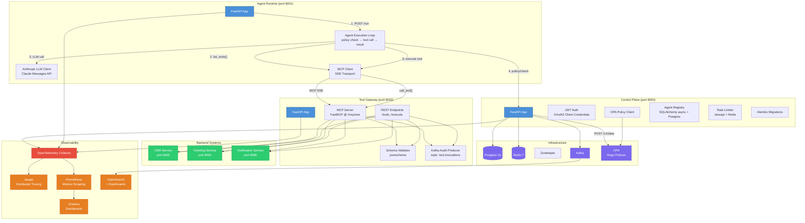

# Enterprise AI Control Plane

A platform for governing AI agent interactions with enterprise systems — identity, authorization, tool mediation, audit, and observability. Built with **Python 3.11+**, **FastAPI** (async/await throughout), **Postgres**, **Kafka**, and the **Model Context Protocol (MCP)**.

---

## Architecture



### Request Flow (End-to-End)

```
User → POST /run {agent_id, prompt}
  │
  ├─ 1. Agent Runtime creates AgentLoop
  ├─ 2. AgentLoop fetches tool schemas via MCP Client → Tool Gateway (MCP SSE)
  ├─ 3. AgentLoop sends prompt + tool defs to Anthropic Claude
  │
  ├─ 4. Claude responds with tool_use block (e.g., crm.lookup_customer)
  ├─ 5. AgentLoop checks policy → Control Plane → OPA
  │     ├─ ALLOWED → continue to step 6
  │     └─ DENIED  → return error to Claude, try again
  │
  ├─ 6. AgentLoop calls tool via MCP Client → Tool Gateway
  │     ├─ Schema validation (jsonschema)
  │     ├─ Backend execution (CRM / Ticketing / Notification)
  │     └─ Kafka audit event (topic: tool.invocations)
  │
  ├─ 7. Tool result fed back to Claude
  ├─ 8. Repeat steps 4-7 until Claude returns final text
  └─ 9. Return {run_id, status, steps, tokens_used}
```

---

## Quick Start (from a clean clone)

### Prerequisites

- **Docker & Docker Compose v2+** — all services run in containers
- **Anthropic API key** — for LLM-powered agent runs (set in `.env`)
- **4 GB+ free RAM** — the full stack uses ~3 GB

### Setup: 3 commands

```bash
# 1. Clone and enter the project
cd ai-control-plane

# 2. Copy environment configuration
cp .env.example .env

# 3. Edit .env — set your Anthropic API key (required for agent runs)
#    AGENT_RUNTIME_ANTHROPIC_API_KEY=sk-ant-...
#    Optionally change JWT_SECRET_KEY to a random string

# 4. Start everything
docker compose up -d
```

This starts **18 containers** — Postgres, Redis, Kafka + Zookeeper, OPA, the 3 core services, 3 backend systems, OTel Collector, Jaeger, Prometheus, Grafana, OpenSearch + Dashboards, a Kafka topic initializer, and the audit consumer.

### Verify Everything is Running

```bash
# Check all containers are healthy
docker compose ps

# Test each service health endpoint
for port in 8000 8001 8002 8003 8004 8005; do
  curl -s http://localhost:$port/health | head -c 100
  echo ""
done

# Expected output:
# {"status":"healthy","service":"control-plane"}
# {"status":"healthy","service":"agent-runtime"}
# {"status":"healthy","service":"tool-gateway"}
# {"status":"healthy","service":"crm-service"}
# {"status":"healthy","service":"ticketing-service"}
# {"status":"healthy","service":"notification-service"}
```

### Run a Demo Agent

```bash
# 1. Register an agent
curl -s -X POST http://localhost:8000/agents \
  -H "Content-Type: application/json" \
  -d '{
    "name": "demo-agent",
    "description": "Demo agent for testing",
    "allowed_scopes": [
      "crm.lookup_customer",
      "ticketing.create_ticket",
      "notify.send_message"
    ]
  }' | python3 -m json.tool

# Save the agent_id and api_key from the response — the key is shown only once.

# 2. Get a JWT token
curl -s -X POST http://localhost:8000/auth/token \
  -d "client_id=demo-agent&client_secret=<API_KEY>" | python3 -m json.tool

# 3. Run an agent task
curl -s -X POST http://localhost:8001/run \
  -H "Content-Type: application/json" \
  -d '{
    "agent_id": "<AGENT_ID>",
    "prompt": "Look up customer CUST-001 and create a high-priority support ticket for them about billing issues"
  }' | python3 -m json.tool

# The agent will:
#   - Fetch available tools from the gateway
#   - Call Claude to decide what to do
#   - Look up the customer (crm.lookup_customer)
#   - Get policy approval for each tool call
#   - Create a ticket (ticketing.create_ticket)
#   - Return the final result
```

### Observability Dashboards

| Service | URL | Default Credentials |
|---------|-----|-------------------|
| Grafana | http://localhost:3000 | admin / admin |
| Prometheus | http://localhost:9090 | — |
| Jaeger (Traces) | http://localhost:16686 | — |
| OpenSearch Dashboards | http://localhost:5601 | — |

**Pre-built dashboards:**
- **Service Latency & Error Rate** — P95 latency per endpoint, error rate per service
- **Tool Call Volume & Policy Deny Rate** — Tool usage, success/failure rates, policy decisions

### MCP Protocol Endpoint

Any MCP-compatible client can connect to the tool gateway:

```
SSE endpoint: http://localhost:8002/mcp/sse
Messages:     http://localhost:8002/mcp/messages
```

This allows tools like Claude Desktop or custom MCP clients to call `crm.lookup_customer`, `ticketing.create_ticket`, and `notify.send_message` through the gateway with schema validation and audit logging.

---

## Service Details

### Control Plane (port 8000)
The source of truth for agent identity and authorization.

| Aspect | Implementation |
|--------|---------------|
| **Auth** | OAuth2 client-credentials flow. Agents authenticate with `client_id` + `client_secret` → receive a JWT (python-jose, HS256). |
| **Policy** | Calls OPA's REST API (`POST /v1/data/control_plane/allow`). Rego policies evaluate tool name, agent scopes, and argument constraints (e.g., note length limits). **Fail-closed**: if OPA is unreachable, all actions are denied. |
| **Rate Limiting** | slowapi with Redis backend, keyed per-agent JWT subject. Default: 100 requests/hour. |
| **Database** | Postgres via SQLAlchemy async. Migrations via Alembic (auto-run at startup). Single table: `agents`. |
| **Endpoints** | `POST /agents`, `GET /agents/{id}`, `POST /auth/token`, `POST /policy/check`, `GET /health`, `GET /metrics` |

### Agent Runtime (port 8001)
Orchestrates the agent loop — LLM calls, policy checks, and tool execution.

| Aspect | Implementation |
|--------|---------------|
| **Loop** | `prompt → LLM → tool_use? → policy check → tool execution → result → LLM → ... → final text` |
| **LLM** | Anthropic Messages API (Claude) via the official `anthropic` Python SDK. |
| **Tool Discovery** | MCP Client over SSE transport → Tool Gateway's `/mcp/sse` endpoint. Falls back to REST on connection failure. |
| **Policy Integration** | Every tool call is checked against the control plane before execution. Denied calls return structured errors to the LLM for graceful handling. |
| **Endpoints** | `POST /run`, `GET /runs/{id}`, `GET /health`, `GET /metrics` |

### Tool Gateway (port 8002)
Single mediation point for all tool calls — implements both MCP protocol and REST.

| Aspect | Implementation |
|--------|---------------|
| **MCP Server** | `FastMCP` framework, tools registered with `@mcp.tool(name=...)`. SSE endpoint at `/mcp/sse`. |
| **REST API** | `GET /tools` (list schemas), `POST /execute` (call a tool) — kept for internal service-to-service calls and backward compatibility. |
| **Schema Validation** | Every invocation validated against JSON Schema (jsonschema) before reaching backends. |
| **Audit Logging** | Kafka producer emitting to `tool.invocations` topic. Each event includes tool name, arguments, agent ID, success/failure, duration, and correlation ID. A standalone `audit-consumer` service reads `tool.invocations` and `notifications.outbound` topics from Kafka and writes a flattened JSON audit trail to stdout. |
| **Tools Exposed** | `crm.lookup_customer`, `crm.add_note`, `ticketing.create_ticket`, `ticketing.get_ticket`, `notify.send_message` |
| **Backend Clients** | CRM, Ticketing, Notification — each with tenacity retries (2 attempts, exponential backoff) and 5-second timeouts. |

### Backend Systems

| Service | Port | Data Store | Key Endpoints |
|---------|------|-----------|---------------|
| CRM Service | 8003 | In-memory (seed: CUST-001, CUST-002, CUST-003) | `GET /customers/{id}`, `POST /customers/{id}/notes` |
| Ticketing Service | 8004 | In-memory | `POST /tickets`, `GET /tickets/{id}`, `GET /tickets` |
| Notification Service | 8005 | Kafka publish | `POST /notifications` → emits to `notifications.outbound` |

---

## Design Decisions & Trade-Offs

### Why Shared Postgres Instance (Demo) vs Per-Service Databases (Production)?

**Demo choice (shared):** All services share one Postgres instance (`postgres:16`) with separate logical databases/schemas. This reduces Docker Compose complexity from 6 database containers to 1, cutting startup time and resource usage by ~70%. For a demo/portfolio project that runs on a laptop, this is the pragmatic choice.

**Production choice (per-service):**
- **Isolation:** A buggy migration in one service can't affect another service's schema or data.
- **Scaling:** CRM might need read replicas; the control plane might need higher IOPS for policy audit logs. Per-service databases let you right-size each instance.
- **Ownership:** In a real enterprise, the CRM team owns the CRM database, the ticketing team owns the ticketing DB. Separate instances enforce team boundaries.
- **Blast radius:** A connection pool exhaustion in one service doesn't starve others.

**What we'd actually do:** Use Terraform (provided under `infra/terraform/`) to provision one RDS instance per service, each with its own security group, parameter group, and automated backup schedule. The `database_url` config per service points to its dedicated endpoint.

### Why OPA vs a Custom Policy Engine (e.g., if/else in Python)?

**We chose OPA** because policy and application code have fundamentally different lifecycles:
- **Policy changes fast:** "Deny all ticket creation after 6 PM" doesn't require a deploy. With OPA, update a Rego file and reload.
- **Policy needs auditing:** Every policy decision can include the exact rule that fired. Custom code would need manual instrumentation for the same transparency.
- **Policy is cross-cutting:** The same policy that governs agent tool calls could govern human admin actions, API tokens, or webhook invocations. OPA decouples policy from any single application.
- **Rego is declarative:** Expressing "agent X can call tool Y only if amount < $500 AND customer is not in the suspended tier" is a 3-line Rego rule. The equivalent nested if/else in Python is error-prone and hard to audit.

**The trade-off:** OPA adds latency (~1-5 ms per decision for local OPA, ~10-50 ms for network calls). For sub-millisecond decisions, a local Redis cache of policy decisions (with TTL) would bridge the gap. We also added tenacity retries with fail-closed behavior — if OPA is down, everything is denied by default (no unsafe fallback).

**Alternative considered:** A Python policy engine using `simpleeval` or `pql` — simpler to deploy (no extra container) but harder to audit, test independently, or share across services. OPA's `opa test` command lets you write unit tests for policies without running any application code.

### Why Kafka vs a simpler message queue (RabbitMQ / Redis Pub/Sub)?

Kafka was chosen for **durability, replayability, and multiple consumer groups**:
- **Durability:** Events persist to disk and survive consumer crashes. With RabbitMQ, once consumed, the message is gone (unless explicitly acknowledged with retry logic). Kafka's log-based storage means we can replay a week of audit events for compliance.
- **Multiple consumers:** Kafka handles this natively with consumer groups; RabbitMQ would need exchange-to-exchange bindings or a fanout pattern.
- **Ordering:** Kafka preserves message order within a partition. For audit trails, knowing that "policy check happened BEFORE tool execution" is critical.

**The trade-off:** Kafka is heavy for a demo — Zookeeper + broker use ~1 GB RAM. For a simpler setup, Redis Streams or Redpanda (Kafka-compatible, single binary) would be lighter. The `docker-compose.yml` includes a `kafka-init` service that creates the 4 topics automatically.

> **Current audit coverage:** The Kafka topics `tool.invocations` (published by the tool gateway) and `notifications.outbound` (published by the notification service) are live today. The `policy.decisions` and `agent.executions` topics are created but not yet published — this is the next iteration of the audit pipeline.

### Why MCP vs Custom REST Protocol?

The Model Context Protocol is becoming the standard for AI-tool integration (supported by Claude Desktop, Cursor, and other AI tools). By implementing MCP in the tool gateway:
- Any MCP-compatible client can use our tools, not just our agent runtime
- The gateway becomes a reusable infrastructure component, not tied to our platform
- Tool schemas are auto-generated from Python type hints via FastMCP

The REST endpoints remain for internal service-to-service calls where the overhead of SSE connections isn't justified.

### Why FastAPI + Async/Await?

Every inter-service operation is I/O-bound: HTTP calls to backends, database queries, Kafka publishes, OPA policy checks. Python's `async/await` with FastAPI handles thousands of concurrent operations on a single process — no threading overhead, no GIL contention, no connection pool starvation. The `asyncio` event loop context-switches between operations while waiting for network responses, achieving throughput comparable to Node.js or Go for this workload pattern.

### What Would Change for Production Scale

1. **Service Isolation:**
   - **Databases:** One RDS instance per service (see Terraform modules for VPC + RDS).
   - **Kafka:** Amazon MSK with 3 brokers across AZs, topic replication factor = 3.
   - **Redis:** ElastiCache Redis Cluster with replication group.

2. **Secrets Management:**
   - **Current:** Environment variables in `.env` and `docker-compose.yml`.
   - **Production:** AWS Secrets Manager or HashiCorp Vault, accessed via Secrets Store CSI driver in Kubernetes. Secrets are **never** in environment variables at rest — only injected into the pod at runtime.

3. **Observability:**
   - **Tracing:** Switch from Jaeger (single-instance) to Amazon Managed Grafana + AWS X-Ray or Grafana Tempo (horizontally scalable).
   - **Metrics:** Prometheus with Thanos for long-term storage and跨-cluster querying.
   - **Logging:** Fluent Bit → Amazon OpenSearch Serverless (instead of self-managed OpenSearch).
   - **Alerting:** Prometheus AlertManager → PagerDuty for on-call.

4. **Networking:**
   - **Current:** Plain HTTP between containers.
   - **Production:** mTLS via Istio or Linkerd service mesh. All inter-service traffic encrypted and authenticated. Policy enforcement at the mesh level for zero-trust.

5. **Deployment:**
   - **Current:** `docker compose up` on a single machine.
   - **Production:** EKS cluster (Terraform module provided under `infra/terraform/modules/eks/`). ArgoCD for GitOps deployments. Canary deployments with Flagger. HPA (Horizontal Pod Autoscaler) based on custom metrics (queue depth, request latency).

6. **CI/CD Pipeline:**
   - **Current:** GitHub Actions → build + test + push to GHCR.
   - **Production:** Add security scanning (Trivy/Snyk), integration tests against a staging environment, load tests (k6), and approval gates for production deployments.

7. **Agent Runtime Scaling:**
   - The agent runtime is **stateless** — it stores run traces in memory (lost on restart). Production would use Postgres or Redis for run persistence, and the runtime would scale horizontally behind a load balancer. Each agent run is independent, so horizontal scaling is linear.
   - The control plane is **stateful** (Postgres + Redis) but can scale with read replicas for the API and a write-primary for mutations.
   - The tool gateway is **stateless** — scales horizontally. The MCP SSE connections are persistent but lightweight; a load balancer with session affinity (sticky sessions) would keep MCP clients connected to the same gateway instance.

---

## Project Structure

```
ai-control-plane/
├── docker-compose.yml              # 18 services, one command
├── Makefile                        # up, down, test, lint, typecheck
├── .env.example                    # All required environment variables
├── README.md                       # This file
│
├── libs/shared_schemas/            # 📦 Shared Pydantic v2 models
│   └── shared_schemas/
│       ├── agent.py                # Agent, AgentRegistration, AgentScope
│       ├── policy.py               # PolicyRequest, PolicyDecision
│       ├── tool.py                 # ToolSchema, ToolInvocation, ToolResult
│       ├── events.py               # AuditEvent, ExecutionEvent
│       └── logging_config.py       # Structured JSON logging setup
│
├── services/
│   ├── control-plane/              # 🛡️ Identity + policy + registry
│   │   ├── app/
│   │   │   ├── main.py             # FastAPI app with all endpoints
│   │   │   ├── auth.py             # JWT auth, OAuth2, bcrypt
│   │   │   ├── policy.py           # OPA client with retries
│   │   │   ├── registry.py         # Agent CRUD operations
│   │   │   ├── rate_limit.py       # slowapi + Redis
│   │   │   └── db/
│   │   │       ├── models.py       # SQLAlchemy ORM: AgentModel
│   │   │       ├── database.py     # Async engine + session
│   │   │       └── migrate.py      # Alembic migration runner
│   │   ├── alembic/                # Schema migrations
│   │   ├── tests/
│   │   └── Dockerfile
│   │
│   ├── agent-runtime/              # 🤖 LLM agent loop
│   │   ├── app/
│   │   │   ├── main.py             # POST /run, GET /runs/{id}
│   │   │   ├── loop.py             # Agent execution loop
│   │   │   ├── llm_client.py       # Anthropic API wrapper
│   │   │   ├── mcp_client.py       # MCP SSE client with REST fallback
│   │   │   └── control_plane_client.py
│   │   ├── tests/
│   │   └── Dockerfile
│   │
│   └── tool-gateway/               # 🔧 MCP + REST tool mediation
│       ├── app/
│       │   ├── main.py             # FastAPI app + MCP mount
│       │   ├── mcp_server.py       # FastMCP tool definitions
│       │   ├── schema_validator.py # jsonschema validation
│       │   ├── audit.py            # Kafka audit producer
│       │   └── backends/           # CRM, Ticketing, Notification clients
│       ├── tests/
│       └── Dockerfile
│
├── backend-systems/                 # 🏢 Mock enterprise services
│   ├── crm-service/                # Customer management
│   ├── ticketing-service/          # Support tickets
│   └── notification-service/       # Kafka-based notifications
│
├── services/audit-consumer/         # 📋 Kafka → audit trail
│   ├── Dockerfile
│   ├── requirements.txt
│   └── main.py                     # Reads tool.invocations + notifications.outbound, writes JSON to stdout
│
├── infra/
│   ├── terraform/                  # ☁️ AWS IaC (plan, not applied)
│   │   └── modules/                # VPC, EKS, RDS modules
│   ├── k8s/                        # Kubernetes manifests (TBD)
│   └── observability/
│       ├── opa/policy.rego         # Rego authorization policies
│       ├── prometheus.yml          # Scrape config for 6 services
│       ├── otel-collector-config.yaml
│       └── grafana/                # Pre-built dashboards + datasources
│
└── .github/workflows/ci.yml        # GitHub Actions: lint, test, build
```

## Terraform (AWS)

Infrastructure-as-Code under `infra/terraform/` for deploying to AWS:

```bash
cd infra/terraform
terraform init
terraform plan  # Preview what would be created
```

Provisioned resources:
- **VPC** with public/private subnets, NAT gateways, VPC endpoints (S3, ECR, Secrets Manager)
- **EKS cluster** with managed node groups (t3.medium, 2-6 nodes)
- **RDS Postgres** (db.t3.medium, encrypted, automated backups)
- **MSK** (Managed Kafka, 2 brokers, kafka.t3.small)
- **Secrets Manager** entries for JWT key, DB credentials, Anthropic API key

This is **not applied** — it's a reference architecture that documents what a production deployment would look like. Run `terraform apply` only after reviewing the plan and configuring the backend (S3 bucket for state).

## CI/CD

GitHub Actions workflow (`.github/workflows/ci.yml`) runs on every PR and merge to `main`:

| Stage | What it does |
|-------|-------------|
| **Lint** | `ruff check` on all Python files |
| **Type Check** | `mypy` on shared schemas and control plane |
| **Test: Shared Schemas** | `pytest` for model validation |
| **Test: Control Plane** | `pytest` with Postgres service container |
| **Test: Tool Gateway** | `pytest` for schema validation, audit events, end-to-end flow |
| **Build & Push** | On `main` merge: build 6 Docker images → GitHub Container Registry, tagged with `git SHA` + `latest` |

## LangGraph (Resona) Integration

See [`docs/resona-integration.md`](docs/resona-integration.md) for a detailed guide on connecting a LangGraph agent to this control plane through the governed tool gateway, including the three-node flow: `auth_node → policy_node → tool_node`.
